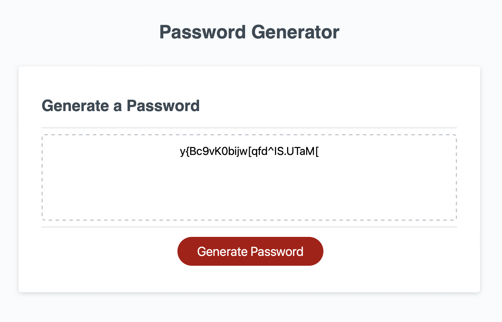

# Password-Generator

## Table of Contents
* [Projects Description](#projects-description)
* [Screenshots - Code examples](#screenshots---code-examples)
* [Technologies Used](#technologies-used)
* [Links](#links)

## Projects Description
In this project, the purpose was to create an application that allows a user to generate a random password that satisfies a set of established requirements for length, letter case, number of characters, and special characters. This application had a starter code that included a simple HTML and CSS files, I worked on javascript to power the application in the browser and used functions, if/else if/else statements, and for loops.

 


## Screenshots - Code examples
Screen shot of application


Collecting user character inputs to create a password 
```js  
    var hasUpperCase = confirm("Do you want to include upper case letters?");
    var hasLowerCase = confirm("Do you want to include lower case letters?");
    var hasSpecialChar = confirm("Do you want include special characters?");
    var hasNumbers = confirm("Do you want to include numbers?");
 ```

## Technologies Used 


## Links
link to github: https://github.com/nfallis96
link to deployment: https://nfallis96.github.io/Password-Generator/